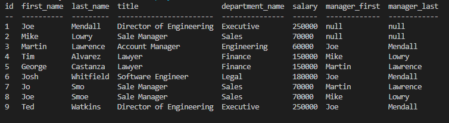

# Employee Tracker

## Project Description
This project is a Node.js application that utilizes a content management system to allow employers to track employees. This system specifically allows users to update employees, add roles, employees, departments, and view roles, employees, and departments through a series of prompts via the commandline. 


## How to Use
In order to use this application install the following dependencies: mysql, inquirer, and console.table. Start the server from the command line using npm start and then follow the corresponding prompts to view or modify items from the employee tracker database.

## Table of Contents

-[How to Use](#how-to-use),
-[Video Link](#video-link),
-[Images](#images)npm

## Video Link
[Walkthrough Video](https://drive.google.com/file/d/1wn__aWdjOpzZ_dl74NU9WKMGm7C_M02Y/view)

## Images
 ```md
    
    ```

